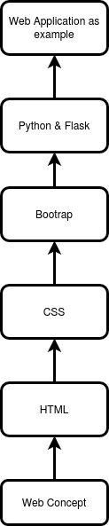

# A tree knowledge for Web development.
I am building a tree knowledge for web development. At the root of the tree, I learn about web concepts so that I will understand how the web works. 
The concepts include: 
* Basic Web concepts: how the web works, how the internet works, domain name, what is website, webpage, webserver...
* Server-side concepts: static web applications, dynamic web applications...
* HTTP protocol: structure of HTTP message, HTTP GET, HTTP POST...
* Advanced concepts: Cache, cookie, web security...     

Next, I learn how to structuring the web with HTML.  
Then, I learn how to styling the web with CSS. And learn about a front end library Bootrap.  

Later, I select a backend programming language and a web framework to explore how to write code backend side. Here, I choose Python and Flask framework.   
This roadmap can be changed over time when I think there are some things to add up.

  

