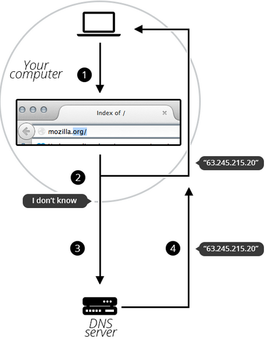

# Domain Name
Src: https://developer.mozilla.org/en-US/docs/Learn/Common_questions/What_is_a_domain_name  
Any Web server can be reached by typeing the IP address in browser. But It's hard for people to remember IP address.   

So Domain Name was invented to solve this problem, by maping IP addresses to domain names. Such as _google.com_ have ip address is  173.194.121.32.   

## Structure of domain names. 
A domain name has a simple structure as diagram below:

* **TLD:** TLD tell users the general purpose of the service behind the domain name. The most generic TLDs (.com, .org, .net) do not require web service to meet any particular criteria, but some TLDs enforce stricter policies so it is clearer what their purpose is. For example:   
  * Local TLDs such as .us, .fr, or .se can require the service provided in given language or hosted in a certain country. 
  * TLDs containing .gov are only allowed to be used by government departments.
  * The .edu TLD is only used by educational and academic institutions.

# How does a DNS request work?

1. Type the domain name in browser. 
2. Browser will try to find the domain name at local in your computer. If the domain name is found, this browser will try to connect to web server via ip address. End here.
3. If not, you computer will try to ask a DNS server about domain name, then DNS will reply the real ip address. Then you computer will know about the domain name and save it locally. In case, the DNS server does not know the domain name, it will ask the another DNS server in next level, util a DNS server know, and then reply to other DNS servers, DNS server then save information about the domain name. 
4. If the domain name is not found, then  you will receive an error 404 not found. 
