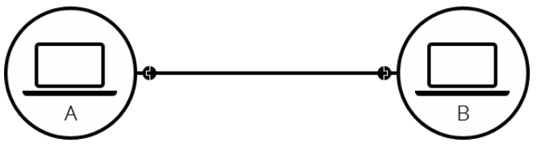

# Internet
Src: https://developer.mozilla.org/en-US/docs/Learn/Common_questions/How_does_the_Internet_work
  
The Internet is the backbone of the Web, the technical infrastructure that makes the Web possible. At its most basic, the Internet is a large network of computers which communicate all together.  

The history of the Internet is somewhat obscure. It began in the 1960s as a US-army-funded research project, then evolved into a public infrastructure in the 1980s with the support of many public universities and private companies. The various technologies that support the Internet have evolved over time, but the way it works hasn't changed that much: Internet is a way to connect computers all together and ensure that, whatever happens, they find a way to stay connected.

## A Simple Network
When two computers need to communicate, you have to link them, either physically (usually with an Ethernet cable) or wirelessly (for example with WIFI or Bluetooth system). All modern computers can sustain any of those connections.  

Such a network is not limited to two computers. You can connect as many computers as you wish. But it gets complicated quickly. If you're trying to connect, say, ten computers, you need 45 cables, whit nine plugs per computer!

To solve this problem, each computer on a network is connected to a special tiny computer called a router. This router has only one job: like a signaler at a railway station, it makes sure that a message sent from a given computer arrives at the right destination computer. To send a message to computer B, computer A must send the message to router, which in turn forwards the message to computer B and makes sure the message is not delivered to computer C.   

Once we add a router to the system, our network of 10 computers only requires 10 cables: a single plug for each computer and a router with 10 plugs. 

## A network of networks. 
So far so good. But what about connecting hundreds, thousands, billion of computers? Of course a single router can't scale that far, but, if you read carefully, we said that a router is a computer like any other, so we can connect two router together:  

By connecting computers to routers, then routers to routers, we are able to scale infinitely.

Such a network come close to what we call the Internet. But this just our own network. What about other's network? The rest of the world's network. We have a device called modem. This modem turns the information from our network into information manageable by the other network such as telephone and vs. 

We are connected to telephone network. So how to send a message to the network we want to reach. To do that, we have to connect your own network to an Internet Service Provider (ISP). An ISP is a company that manages some special routers that are all linked together and can also access other ISPs' router. So the message from our network is carried through the network of ISP network to the destination network. The Internet consists of this whole infrastructure of network.

## Finding Computer
Each computer/ network devices has its IP address which is unique location in the whole of internet. In a message or package contain IP address of the destination nework then the MAC address of the destination computer. So that routers in the internet can route the package to the right way based on the route table. 

A website has IP address too, we can access website directly by IP address. But it hard to remember the IP address, so we have domain name. For example, domain name google.com has ip address 173.194.121.32. 

## Internet and the Web. 
The internet is an infrastructure, whereas the Web is a service built on top of the infrastructure. 