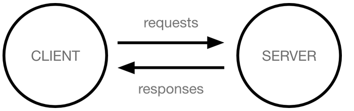

# How the Web works
Explain simple concept of how the web works.  
Src: https://developer.mozilla.org/en-US/docs/Learn/Getting_started_with_the_web/How_the_Web_works
## Client and servers
Computer connected to the web are called clients, and the ones contain webpages/ backend are called servers. A simple diagram of how they interact might look like this:  

  

* Client are the typical web user's internet connected devices (for example, your computer connected to your Wi-Fi, or your phone connected to your mobile network) and web-accessing software available on those devices (usually a web browser like Firefox or Chrome)

* Servers are computers that store webpages, sites, or apps. When client want to access webpage, a copy of the webpage is downloaded from the server onto the client machine and display in the user's browser.

## The other parts of the toolbox
The description above don't tell the whole story about web. There are many parts involved, such as TCP/IP, DNS, HTTP ... 
   
Let's image a road between client and server. On one end of the road is the client which is like your house. And another is server, which is a shop you want to buy something form (webpages).   

So what's the road? The road is internet connection which you use to retrieve datas from server.  

Let's try to explain other concept:   

* **Your internet connection**: Allow you to send and receive data on the web. It's basically like the road between your house and the shop.  
* **TCP/IP**:  Transmission Control Protocol and Internet Protocol are communication protocols that define how data should travel across the internet. This is like transport mechanisms that let you place an order, go to shop, and buy your goods. In our example, this is like a car or a bike (or however else you might get around).
* **DNS**: Domain Name Servers are like an address book for websites. When you type a web address in your browser, the browser looks at the DNS to find the website's real address before it can retrieve the website. The browser need to find out which server the website lives on, so it can send HTTP messages to the right place. This is like looking up the address of the shop so you can buy things.  
* **HTTP**: Hypertext Transfer Protocol is an application protocol that defines a language for clients and servers to speak to each other. This is like the language you use to order your goods. 
* **Component Files**: A Website is made up of many different files, which are like the different parts of goods you buy from the shop. These files come in two main type:  
  * **Code files**: Websites are built primarily from HTML, CSS and JavaScript, though there are other technologies, web framework  
  * **Assets**: This is a collective name for all the other stuff that makes up a website, such as images, music, video, Word document, and PDFs.

## So what happens, exactly?
When you type a web address into your browser (for our analogy that's like walking to the shop):   
1. The browser goes to the DNS server, and finds the real address of the sever that the website lives on (you find the address of the shop)
2. The browser sends an HTTP request to the server, asking it to send a copy of the website to the client (you go to the shop and order your goods). This message, and all other data sent between the client and the server, is sent across your internet connection using TCP/IP.
3. If the server approves the client's request, the client sends the client a "200 OK" message, which means "Of course you can look at that website! Here it is", and then starts sending the website's file to the browser as a series of small chunks called data packets (the shop gives you your goods, and you bring them back to your house).
4. The browser assembles the small chunks into a complete web page and displays it to you.

## DNS explained
Real web addresses aren't the nice, memorable strings you type into your address bar to find your favorite websites. They are special numbers that look like this: 63.245.215.20  

This is called an IP address, and it represents a unique location on the web. However, it's not very easy to remember, is it? That's why Domain Name Servers were invented. These are special servers that match up a web address you type into your browser to the website's real IP address.   

Websites can be reached directly via their IP addresses.

## Packets explained
Eariler we used the term "packets" to describe the format in which the data is sent from server to client. What do we mean here? Basically, when data is sent across the web, it is sent as thousands of small chunks, so that many different web users can download the same website at the same time. If websites are sent as single big chunks, only one user could download one at a time, which abviously would make the web very inefficient and not much fun to use.

