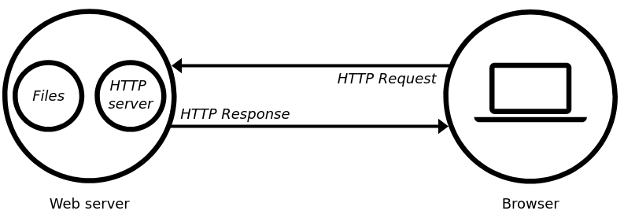

src: https://developer.mozilla.org/en-US/docs/Learn/Common_questions/What_is_a_web_server
# Web server
Web server has two side:
* Hardware: Web server is a computer that contain web sever software and website's component files. (for example, HTML document, images, CSS stylesheet and JavaScript files). A web server connects to the Internet and supports physical data interchange with other devices connected to the web.   

* Software: A web server includes several parts that control how web users access hosted files. At a minimum, this is an HTTP server. An HTTP server is software that understands URLs (Web addresses) and HTTP (the protocol your browser uses to view the web page). An HTTP server can be accessed through the domain names of the website it store, and it delivers the content of these hosted websites to the end user's device.

Whenever a browser needs a file from web server, it will send a request via HTTP. When the request reaches the correct (hardware) web server, the (software) HTTP server accepts the request, find the requested document and send it back to the browser, also through HTTP. And in case the file is not found, a HTTP response 404 will be sent to the browser. 

There are two kinds of web server:  
* A static web server, or stack, consists of a computer (hardware) will an HTTP server (software). We call it "static" because the server sends its hosted files as-is to your browser.  
* A dynamic web server consists of a static web server plus extra software, most commonly an application sever and a database. We call it "dynamic" because the application server updates the hosted files before sending them to the browser via HTTP server.

## Hosting files
A web server has to store the website's files, namely all HTML document and their related assets, including images, CSS, and JavaScript files, fonts and video.  

A computer can be used to be a webserver but there are reason to use a dedicated web server because:  
* A dedicated web server is typically mor available. (up and running)

* Excusing downtime and system troubles, a dedicated web server is always connected to the Internet. 

* A dedicated web server can have the same IP address all the time. This is known as dedicated IP address. 

* A dedicated web server is typically maintained by a third-party. 

## Communication through HTTP
A web server provides support for HTTP (Hypertext Transfer Protocol). As its name implies, HTTP specifies how to transfer Hypertext (linked web documents) between two computers.   
A protocol is a set of rules for communication between two computers. HTTP is a textual, stateless protocol. 

* Textual: All commands are plain-text and human-readable. 

* Stateless: Neither the server nor the client remember previous communications. For example, relying on HTTP alone, a server can't remember a password you typed or remember your progress on an incomplete transaction. You need an application server for tasks like that. (We'll cover that sort of technology in other articles.)

HTTP provides clear rules for how a client and server communicate:  
* Only clients can make HTTP requests, and then only to servers. Servers can only respond to a client's HTTP request.  

* When requesting a file via HTTP, clients must provide the file's URL. 

* The web server must answer every HTTP request, at least with an error message. 

On a web server, the HTTP server is responsible for processing and answering incoming requests.   

1. Upon receiving a request, an HTTP server first checks if the request URL matches an existing file. 

2. If so, the web server sends the file content back to the browser. If not, an application server builds the necessary file. 

3. If neither process is possible, the web server returns an error message to the browser, most commonly 404 Not Found. 
